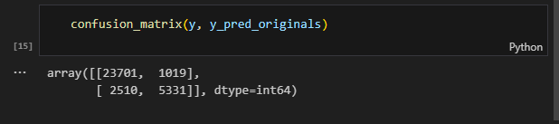
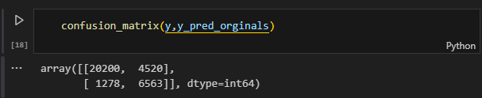

# CENSUS INCOME - RANDOM FOREST CLASSIFIER


Este proyecto utiliza el conjunto de datos **Census Income** del repositorio de **UCI Machine Learning** para predecir si una persona gana más o menos de $50,000 al año, basándose en diversas características sociodemográficas. 

El modelo de clasificación seleccionado es el **Random Forest Classifier**, conocido por su robustez y capacidad para manejar tanto datos desbalanceados, ya que el conjunto de datos a nuestra disposicion presenta clases desbalanceadas, es decir mayor cantidad de datos correspondientes a ">50K" que a "<=50K". Las caracteristicas son:

1. **age** (edad)
2. **workclass** (tipo de trabajo)
3. **fnlwgt** (ponderación final)
4. **education** (nivel de educación)
5. **education-num** (número de años de educación)
6. **marital-status** (estado civil)
7. **occupation** (ocupación)
8. **relationship** (relación)
9. **race** (clasificación racial) 
10. **sex** (sexo)
11. **capital-gain** (ganancia de capital)
12. **capital-loss** (pérdida de capital)
13. **hours-per-week** (horas de trabajo por semana)
14. **native-country** (país de origen)
15. **income** (ingreso)

## RESULTADOS

Se entrenaron seis modelos, los cuales cuentan con diferentes caracteristicas y resultados. Esto con la finalidad de darle un mejor manejo al tema del desbalanceo de datos, ademas de que se evito el uso de 2 variables resultaron poco relevantes desde el primer entrenamiento de datos ('native_country' y 'race'), REVISAR: ademas de que eticamente pueden incurrir en temas de clasismo. 

Las conclusiones exactas de cada modelo entrenado se pueden revisar en el notebook de cada uno, aqui se mostrara una vision superficial sobre realizado y obtenido.

### - **MODELO 1**: 

Se realizo una breve revision a los datos encontrado 3 conclusiones claves:
- Variable objetivo ('income') desbalanceados
- 'native_country' desbalanceada: aproximadamente el 90% de los datos provenian de personas de una unica nacionalidad (USA)
- 'race' desbalanceado: La mayoria de los datos provenian de personas de raza blanca

Visualizando el 'feature importances' del primero modelo creado encontramos que estas 2 variables anteriormente mencionadas no aportaban mucho al modelo y se decidio no usarlas en modelos posteriores. Resultados con datos de testeo:


Resultados con todo el conjunto de datos:


Matriz de confusion con predicciones de todo el conjunto de datos


Ademas de la evaluacion de rendimiento del modelo con los datos del testeo, tambien se opto por verificar el rendimiento del modelo con todos los datos ya que el testeo mostraba una vision sesgada del modelo. Estas comparaciones nos ayudaran a deducir que modelo performeo mejor, sobre todo teniendo en cuenta los TP y FP, que son las predicciones que mas influencia tienen en las metricas de preccion y accuracy de cada clase.

### - **MODELO 2**:

Se tomo en cuenta eliminacion de las variables anteriormente mencionadas, ademas del uso de 'Grid-Search' para encontrar la mejor combinacion de hiperparametros para nuestro modelo. 

Esta combinacion fue:
`{'max_depth': 20, 'max_features': 5, 'min_samples_leaf': 6, 'min_samples_split': 2, 'n_estimators': 200}`

Se mostro una mejora en el perfomance con los datos de  testeo:


Sin embargo al momento de evaluar con todo el  set de datos orginales encontramos mayor cantidad de FP y FN, es por ello que anteriormente se menciono que la evaluacion con datos de testeo nos mostraba una falsa sensacion de performance optimo.




### - **MODELO 3**

Primer intento para abordar el tema del desbalanceo de datos. Se uso 'Grid-Search' para buscar un conjunto de pesos adecuados para el hiperparametro 'class_weight', ya que los parametros propuestos como 'balanced' y 'balanced_supsample' mostraron bajos performance.

`param_grid = {
    'class_weight':[{' <=50K': 0.1*i, ' >50K':1.1} for i in range(10)]}`

Se encontro que el mejor parametro fue: 

`{'class_weight': {' <=50K': 0.9, ' >50K': 1.1}}`

Resultados con datos de testeo:


Sucede lo mismo que en caso anterior, ya que analizando con los datos originales totales tenemos lo siguiente:


No tenemos una gran diferencia con el modelo 2 en cuando a FP y TP, asi que no consideramos este procedimiento como el mas optimo. Tambien se considero el cambio de los pesos para ' >50K', sin embargo la evaluacion fue menor a la mostrada aqui.

### - **MODELO 4**

Para el tema del desbalanceo usamos la técnicas SMOTEENN. Esta técnicas combinan SMOTE para sobremuestrear la clase minoritaria y luego eliminan ejemplos ruidosos o redundantes de la clase mayoritaria, mejorando la calidad de los datos balanceados.


Los resultados luego del entrenamiento con los datos de testeo:


Se mostro una apartente mejora en la precision y recall. Pero ahora mostraremos el contraste evaluando el modelo con los datos originales



Si bien tenemos una mejora en cuenta al reconocimiento de la clase minoritaria, la capacidad del modelo para precedir la clase mayoritaria cayo fuertemente, teniendo asi mas FP y menos TN. Esto se puede deber a que al submuestrear la clase mayoritaria se perdio informacion relvante, ademas de que al sobremuestrear la clase minoritaria, estos datos sesgaron mas la identificacion de la clase mayoritaria

### - **MODELO 5**

Aqui solo submuestreamos la clase mayoritaria para poder equipararla con los datos de la clase minoritaria. 

Resultados con datos de testeo:


Resultados con datos originales totales:


Constantemente estamos teniendo el mismo problema del aumento en los FP, ya sea por que perdemos informacion relevante para la identificacion de la clase mayoritaria o por que estamos generando ruido que evite su buena identificacion.


### - **MODELO 6**

Aqui vamos a sobremuestreear a la clase minoritaria usando 'RandomOverSamppler', para asi equiparar ambas clases. En este caso en particular solo estamos generando ruido por la generacion de nueva data, mas no estamos perdiendo informacion de la clase mayoritaria. Con esto esperamos que el modelo no pierda tanto la capacidad de identificacion para la clase mayoritaria.

Resultados con datos de testeo:


De momento podemos ver una fuerte capacidad de prediccion para ambas clases. Ahora vamos a contrastar esto con los datos originales.


Si bien se optuvo mejoras considerables al momento de predecir la clase minoritaria, tambien se perdio capacidad para la identificacion de la clase mayoritaria lo cual se refleja en los FP, sim embargo podria considerse como un intercambio justo, quedando a criterio de cual sea el uso del modelo.


## CONCLUSIONES FINALES

- Los mejores resultados fueron obtenidos por el **MODELO 1** y el **MODELO 6**.
- La tecnica que brindo mejores resultados (en este caso) para la identificacion de la clase minoritaria fue sobremuestreando datos referentes a esta
- Sacar conclusiones solo con metricas obtenidas de los datos de testeo puede sesgar nuestro entendimiento del modelo, ya que no brinda un panorama general, pues al ser ser 'random forest' un modelo que genera muchos arboles de decision, no hay inconvenientes en usar datos repetidos para su analisis. 


## Requisitos

- [`numpy`, `pandas`, `scikit-learn`,`imblearn`,`seaborn`]

## Extra

- Puedes encontrar el codigo fuente de algunas de las graficas aqui usadas en mi repositorio de datos, el repositorio 'tools_ml', en el cual encontraras diversas herramientas para graficas y evaluar tus modelos de ml (aun esta en proceso de desarrollo)


## Instalación

```bash
# Clonar el repositorio
git clone [URL del repositorio]

# Navegar al directorio del proyecto
cd [nombre del directorio]

# Instalar dependencias
pip install -r requirements.txt
